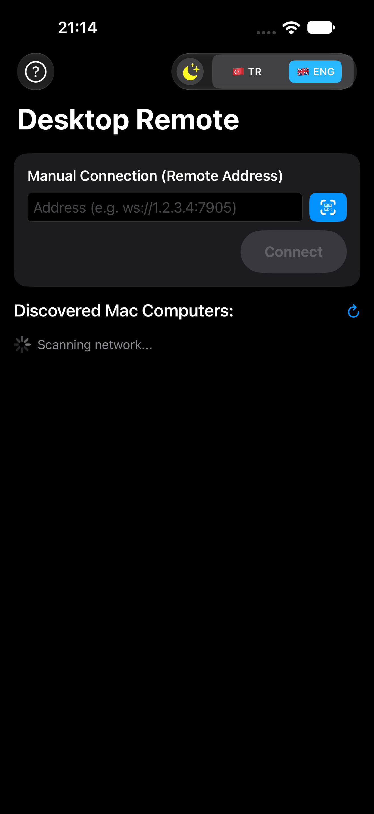
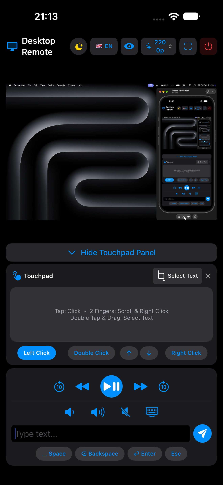
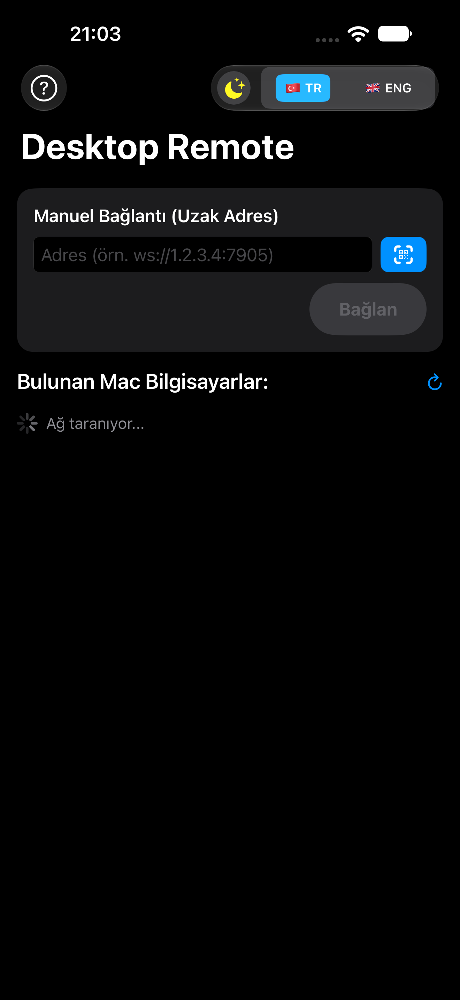
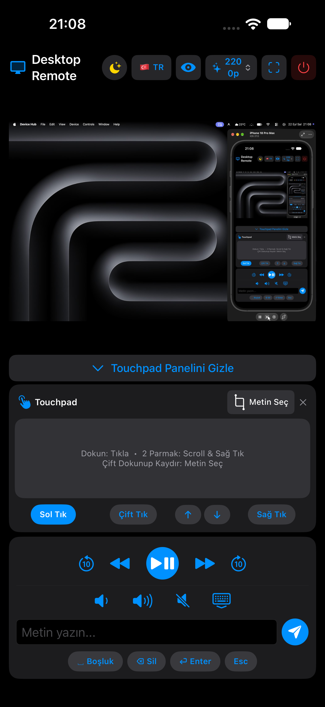

<div align="center">

# 🍎 Mac Remote

### Ultra-Low-Latency Wireless Trackpad, Keyboard & Live Screen Mirror for macOS, from iOS (iPhone & iPad) and Android Devices

<p align="center">
  <a href="README.md"> <b>English</b></a> •
  <a href="README.tr.md"> <b>Türkçe</b></a>
</p>

[](https://github.com/ibrahimtemur/mac-remote/releases/latest)
[](LICENSE)
[](https://github.com/ibrahimtemur/mac-remote)
[](https://github.com/ibrahimtemur/mac-remote/wiki)

<br/>

Turn your **iPhone, iPad or Android** device into a high-precision, hardware-level wireless trackpad, media remote, keyboard and crystal-clear live screen mirror for macOS, over both local Wi-Fi (LAN) and the Internet (WAN).

[Features](#-key-features) • [How It Works](#-architecture--how-it-works) • [Installation](#-installation) • [Security](#-security) • [Wiki](https://github.com/ibrahimtemur/mac-remote/wiki)

</div>

---

## 📸 Screenshots

<div align="center">
  <h3> English Interface</h3>
  <table>
    <tr>
      <td align="center"><b>1. Mobile Discovery & Connection</b></td>
      <td align="center"><b>2. Trackpad, Mirroring & Quality</b></td>
      <td align="center"><b>3. macOS Server Control Panel</b></td>
    </tr>
    <tr>
      <td align="center" valign="top"></td>
      <td align="center" valign="top"></td>
      <td align="center" valign="top"></td>
    </tr>
  </table>

  <h3> Turkish Interface</h3>
  <table>
    <tr>
      <td align="center"><b>1. Device Discovery & Connection</b></td>
      <td align="center"><b>2. Trackpad, Screen & Quality Menu</b></td>
      <td align="center"><b>3. macOS Server Control Panel</b></td>
    </tr>
    <tr>
      <td align="center" valign="top"></td>
      <td align="center" valign="top"></td>
      <td align="center" valign="top"></td>
    </tr>
  </table>
</div>

---

## ✨ Key Features

- 🖱️ **Hardware-Level Trackpad Emulation:**
  - **Smooth Cursor Movement:** Sub-pixel precision synthetic event delivery through macOS CoreGraphics.
  - **Natural Multi-Touch Gestures:** 1-finger tap (left click), 1-finger long press or 2-finger tap (right click) and smooth 2-finger scrolling (vertical & horizontal).
  - **Text Selection & Drag-and-Drop:** Native `kCGEventLeftMouseDragged` support via double-tap-and-drag or a dedicated **"Select Text"** button.
  - **Dock & Hot Corner Triggering:** Easily reach the macOS Dock and Mission Control / Hot Corners with cursor speed and edge detection.
- 📺 **Dynamic Live Screen Mirroring:**
  - Ultra-fast JPEG frame streaming powered by the native ScreenCapture API (`mss`).
  - **4 Dynamic Resolution Levels:** Switch instantly between **800p** (Fast / Low Data), **1200p** (Balanced), **1600p** (Sharp Text / Coding) and **2200p** (Ultra HD Crystal Clarity).
  - Responsive to iPhone and iPad large screens, with a full-screen layout, a floating touchpad drawer and an auto-rotating landscape interface.
  - Toggle an interactive cursor indicator on the preview screen.
- 🎵 **Dedicated Media & System Control Bar:**
  - Play/Pause, Next Track, Previous Track.
  - 10-second forward and backward seek for video and music players.
  - Native system volume buttons (Volume Up, Volume Down, Mute).
- ⌨️ **Expandable Virtual Keyboard:**
  - Full keyboard with quick helper buttons: `␣ Space`, `⌫ Delete`, `⏎ Enter` and `Esc`.
  - Single-stroke text delivery with no key repeat or sticking.
- 🌐 **Zero-Configuration Networking & Remote Access:**
  - **Local Network (LAN):** Automatic Mac discovery via Bonjour / mDNS (`_macremote._tcp.local.`) on iOS (`NWBrowser`) and Android (`NsdManager`).
  - **Internet Access (WAN):** Built-in independent reverse tunnel and QR code generation. Control your Mac over cellular data or an external Wi-Fi network without opening any router ports.
  - **Dynamic 4-Digit PIN Security:** Fast and secure handshake verification.
- 🍏 **Apple Developer ID Signed & Notarized:**
  - The macOS app is distributed as a `.dmg` installer signed with an official Apple Developer ID and passed through Apple's security scan.

---

## 🏗️ Architecture & How It Works

```
┌─────────────────────────────────┐
│          Mobile Client          │
│  • iOS (SwiftUI / Network.fw)   │
│  • Android (Compose / OkHttp)   │
└────────────────┬────────────────┘
                 │
                 ├── 1. Bonjour Auto-Discovery (LAN: _macremote._tcp.local.)
                 ├── 2. 4-Digit PIN Handshake Verification
                 ├── 3. JSON Control Commands (Touch, Gestures, Keys) ───────────► ┌───────────────────────────┐
                 │                                                                │        macOS Server       │
                 │                                                                │   (Python 3.9+ / PyQt6)   │
                 │                                                                ├───────────────────────────┤
                 │                                                                │ • Zeroconf Broadcaster    │
                 │                                                                │ • Asyncio WebSocket Server│
                 │                                                                │ • CoreGraphics (Quartz)   │
                 └── 4. Real-Time JPEG Screen Stream ◄─────────────────────────── │ • Native 'mss' Capturer   │
                                                                                  └───────────────────────────┘
```

1. **Discovery & Pairing:**
   - When the macOS server starts, it announces itself on the local network via Zeroconf / Bonjour (`_macremote._tcp.local.`).
   - iOS (`NWBrowser`) and Android (`NsdManager`) automatically list the Mac server.
   - The client completes a handshake using the 4-digit PIN shown on the Mac screen.
2. **Input Delivery:**
   - Gesture and touch events are sent as lightweight JSON WebSocket packets.
   - The server converts these packets into macOS CoreGraphics Quartz events, providing hardware-level input.
3. **Screen Mirroring:**
   - Screen frames are captured at the selected resolution, compressed into JPEG buffers and sent over WebSocket to the mobile device to be drawn directly on the GPU.

---

## 📥 Installation

### 🍏 macOS (Server)
1. Go to the [Releases](https://github.com/ibrahimtemur/mac-remote/releases/latest) page and download `MacRemote-v1.5.0.dmg`.
2. Open the DMG file and drag **Mac Remote.app** into your `/Applications` folder.
3. **Accessibility & Screen Recording Permissions:**
   - Go to **System Settings** > **Privacy & Security** > **Accessibility** and allow Mac Remote.
   - Under **Screen Recording**, allow Mac Remote to stream your screen.
4. Open the **Mac Remote** app, click **Start Server** and note the 4-digit PIN on the screen.

### 📱 iOS (iPhone & iPad Client)
1. Install the Mac Remote app from the App Store or TestFlight.
2. Make sure your device is on the same Wi-Fi network as your Mac (or enter the WAN remote address shown by your Mac / scan the QR code on screen).
3. Select your automatically discovered Mac (or connect manually / via QR), enter the 4-digit PIN and connect.

### 🤖 Android (Client)
1. Download `MacRemote-Android-v1.5.0.apk` from the [Releases](https://github.com/ibrahimtemur/mac-remote/releases/latest) page, or install the app from the Google Play Store.
2. Open the **Mac Remote** app, select your Mac (or scan the QR code), enter the PIN and connect.

---

## 🔒 Security

Because Mac Remote provides system-level remote access:
- Every session is protected by dynamic 4-digit PIN verification.
- Local Wi-Fi traffic never leaves your local network.
- Internet connections use an isolated reverse TCP tunnel running on an Oracle Cloud Always Free VPS.
- The macOS server is signed with an official Apple Developer ID and approved by Apple Notary.
- See our [Security Policy (SECURITY.md)](SECURITY.md) for responsible disclosure guidelines.

---

## 🗺️ Roadmap

- [x] Multi-touch gestures (Click, Right Click, 2-Finger Scroll, Drag Selection)
- [x] Dynamic screen quality tiers (800p - 2200p)
- [x] Remote access over WAN with an independent reverse tunnel and QR code
- [x] Native iOS (iPhone & iPad) SwiftUI client
- [x] Apple Developer ID signed & Notarized macOS DMG installer
- [ ] Direct WebRTC P2P connection mode
- [ ] Bluetooth LE fallback connection for offline environments
- [ ] Multi-monitor selector on macOS
- [ ] Biometric (Face ID / Fingerprint) quick unlock on mobile
- [ ] Audio streaming from Mac to mobile devices

---

## 📄 License

This project is licensed under the **MIT License** - see the [LICENSE](LICENSE) file for details.

---

<div align="center">
  <sub>Built with ❤️ for a seamless experience across Mac, iOS and Android.</sub>
</div>
