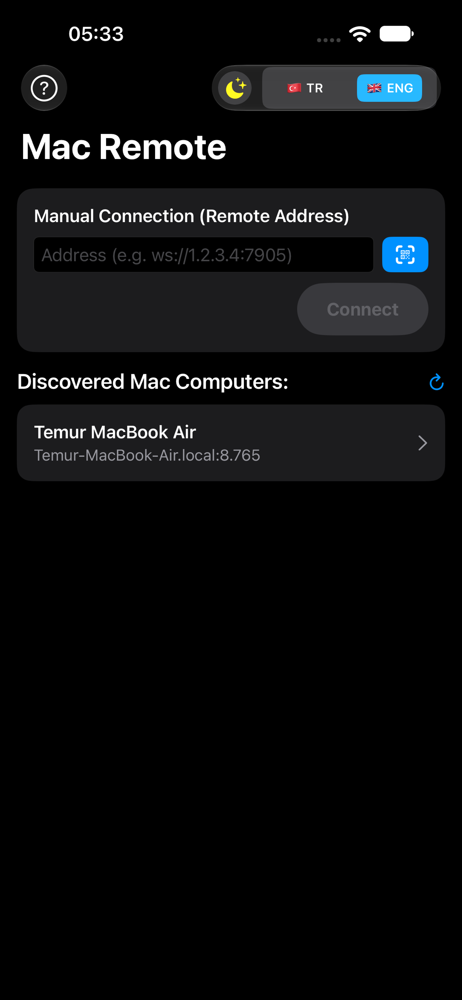
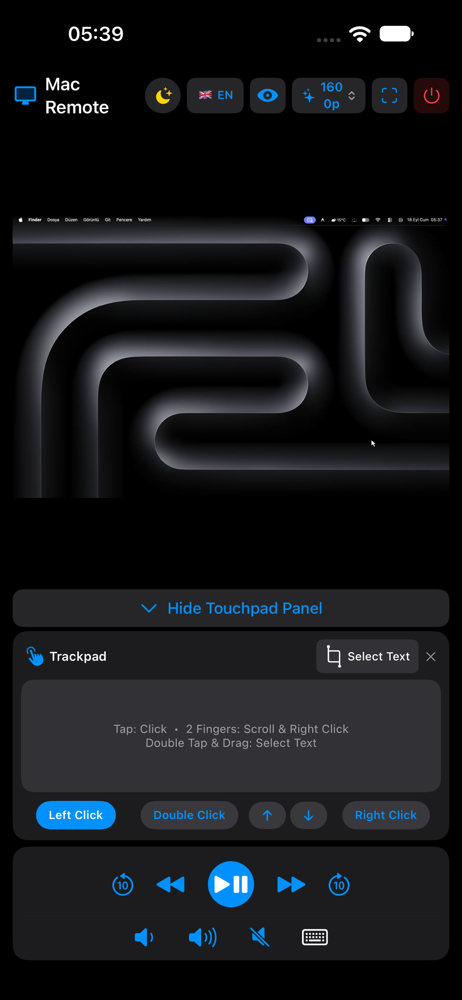
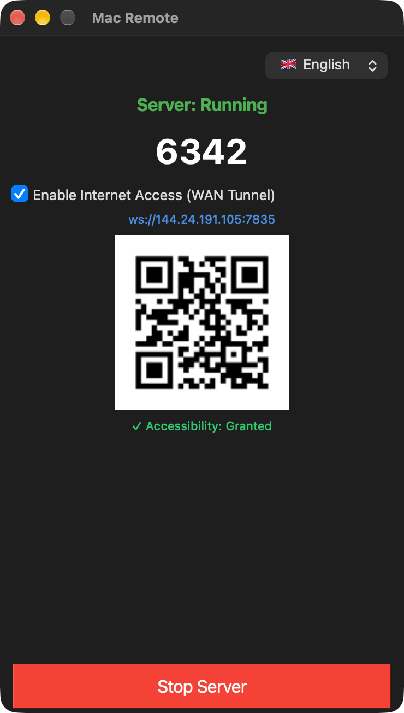
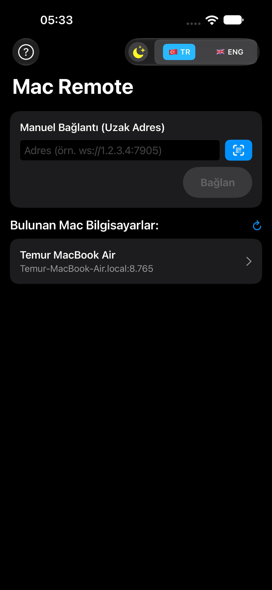
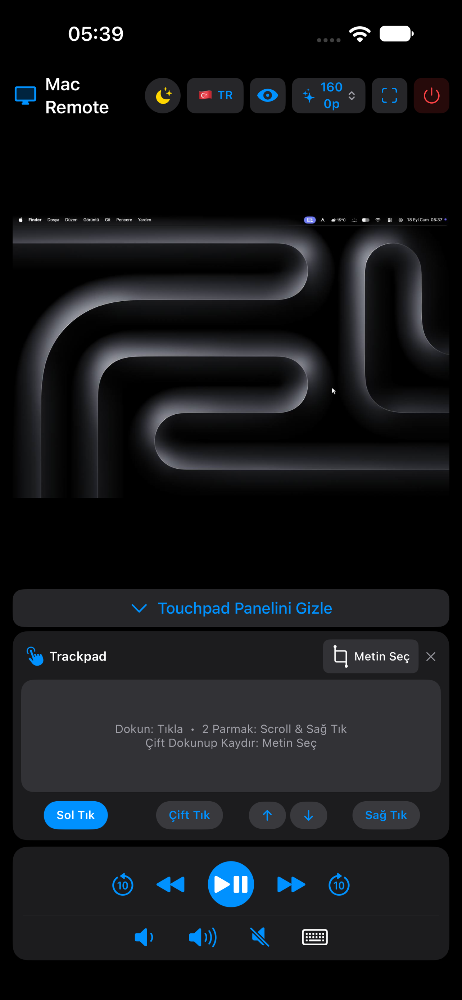
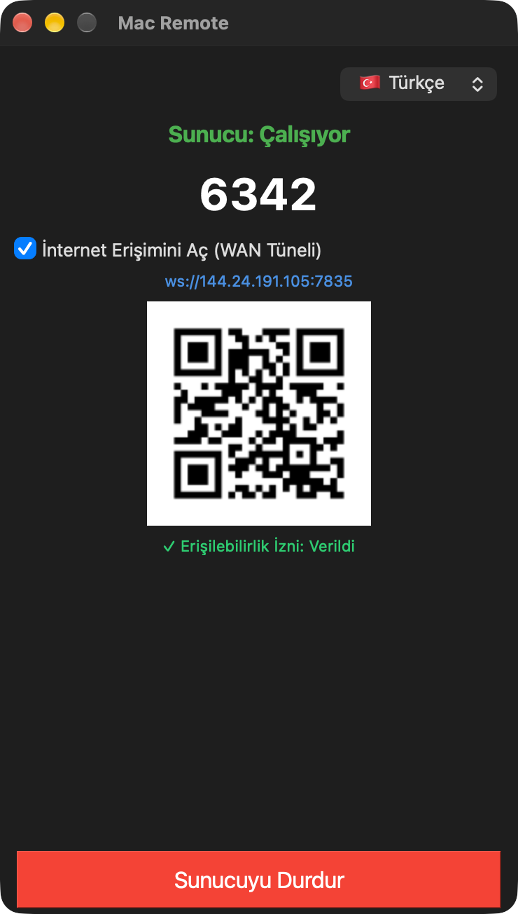

<div align="center">

# 🍎 Mac Remote

### iOS (iPhone & iPad) ve Android Cihazlardan macOS İçin Ultra Düşük Gecikmeli Kablosuz Trackpad, Klavye ve Canlı Ekran Yansıtıcı

<p align="center">
  <a href="README.md"> <b>English</b></a> •
  <a href="README.tr.md"> <b>Türkçe</b></a>
</p>

[](https://github.com/ibrahimtemur/mac-remote-app/releases)
[](LICENSE)
[](https://github.com/ibrahimtemur/mac-remote-app)
[](https://github.com/ibrahimtemur/mac-remote-app/wiki)

<br/>

**iPhone, iPad veya Android** cihazınızı; hem Yerel Wi-Fi (LAN) hem de İnternet (WAN) üzerinden macOS için yüksek hassasiyetli, donanım düzeyinde bir kablosuz trackpad'e, medya kumandasına, klavyeye ve kristal netliğinde canlı ekran yansıtıcısına dönüştürün.

[Özellikler](#-öne-çıkan-özellikler) • [Nasıl Çalışır](#-mimari--nasıl-çalışır) • [Kurulum](#-kurulum) • [Güvenlik](#-güvenlik) • [Wiki](https://github.com/ibrahimtemur/mac-remote-app/wiki)

</div>

---

## 📸 Ekran Görüntüleri

<div align="center">
  <h3> İngilizce Arayüz</h3>
  <table>
    <tr>
      <td align="center"><b>1. Mobil Keşif & Bağlantı</b></td>
      <td align="center"><b>2. Trackpad, Yansıtma & Kalite</b></td>
      <td align="center"><b>3. macOS Sunucu Kontrol Paneli</b></td>
    </tr>
    <tr>
      <td align="center" valign="top"></td>
      <td align="center" valign="top"></td>
      <td align="center" valign="top"></td>
    </tr>
  </table>

  <h3> Türkçe Arayüz</h3>
  <table>
    <tr>
      <td align="center"><b>1. Cihaz Keşfi & Bağlantı</b></td>
      <td align="center"><b>2. Trackpad, Ekran & Kalite Menüsü</b></td>
      <td align="center"><b>3. macOS Sunucu Kontrol Paneli</b></td>
    </tr>
    <tr>
      <td align="center" valign="top"></td>
      <td align="center" valign="top"></td>
      <td align="center" valign="top"></td>
    </tr>
  </table>
</div>

---

## ✨ Öne Çıkan Özellikler

- 🖱️ **Donanım Düzeyinde Trackpad Emülasyonu:**
  - **Akıcı İmleç Hareketi:** Alt piksel (sub-pixel) hassasiyetiyle macOS CoreGraphics sentetik olay gönderimi.
  - **Doğal Çoklu Dokunma Hareketleri:** 1 parmak dokunma (sol tık), 1 parmak basılı tutma veya 2 parmak dokunma (sağ tık) ve 2 parmak akıcı kaydırma (dikey & yatay).
  - **Metin Seçimi ve Sürükle-Bırak:** Çift dokunup sürükleme hareketi veya özel **"Metin Seç"** butonuyla yerel `kCGEventLeftMouseDragged` desteği.
  - **Dock ve Sıcak Köşeler Tetikleme:** İmleç hız sınır algılayıcılarıyla macOS Dock ve Mission Control / Sıcak Köşeleri kolayca çağırma.
- 📺 **Dinamik Canlı Ekran Yansıtma:**
  - Yerel ScreenCapture API (`mss`) destekli ultra hızlı JPEG kare akışı.
  - **4 Dinamik Çözünürlük Seviyesi:** **800p** (Hızlı / Az Veri), **1200p** (Dengeli), **1600p** (Net Metin / Kodlama) ve **2200p** (Ultra HD Kristal Netlik) arasında anında geçiş.
  - iPhone ve iPad geniş ekranlarına duyarlı, yüzen touchpad çekmeceli tam ekran ve otomatik dönen yatay arayüz.
  - Önizleme ekranı üzerinde etkileşimli imleç göstergesi açıp kapama.
- 🎵 **Özel Medya & Sistem Kontrol Çubuğu:**
  - Oynat/Duraklat, Sonraki Parça, Önceki Parça.
  - Video ve müzik oynatıcılar için 10 saniye ileri ve geri sarma.
  - Yerel sistem ses butonları (Sesi Aç, Sesi Kıs, Sessize Al).
- ⌨️ **Genişletilebilir Sanal Klavye:**
  - Hızlı yardımcı butonlara sahip tam klavye: `␣ Boşluk`, `⌫ Silme`, `⏎ Enter` ve `Esc`.
  - Harf tekrarı ve takılma yapmayan tek vuruşlu metin iletimi.
- 🌐 **Sıfır Yapılandırma ile Ağ ve Uzaktan Erişim:**
  - **Yerel Ağ (LAN):** iOS (`NWBrowser`) ve Android (`NsdManager`) üzerinde Bonjour / mDNS (`_macremote._tcp.local.`) ile Mac'i otomatik bulma.
  - **İnternet Erişimi (WAN):** Entegre bağımsız ters tünel ve QR kod üretimi — modem port açma işlemi gerekmeden hücresel veri veya dış Wi-Fi üzerinden Mac'inizi kontrol edin.
  - **Dinamik 4 Haneli PIN Güvenliği:** Hızlı ve güvenli el sıkışma doğrulaması.
- 🍏 **Apple Developer ID İmzalı ve Notarize Edilmiş:**
  - macOS uygulaması resmi Apple Developer ID ile imzalanmış ve Apple güvenlik taramasından geçmiş `.dmg` yükleyicisiyle dağıtılır.

---

## 🏗️ Mimari & Nasıl Çalışır?

```
┌─────────────────────────────────┐
│           Mobil İstemci         │
│  • iOS (SwiftUI / Network.fw)   │
│  • Android (Compose / OkHttp)   │
└────────────────┬────────────────┘
                 │
                 ├── 1. Bonjour Otomatik Keşif (LAN: _macremote._tcp.local.)
                 ├── 2. 4 Haneli PIN El Sıkışma Doğrulaması
                 ├── 3. JSON Kontrol Komutları (Dokunma, Hareketler, Tuşlar) ───► ┌───────────────────────────┐
                 │                                                                │       macOS Sunucu        │
                 │                                                                │   (Python 3.9+ / PyQt6)   │
                 │                                                                ├───────────────────────────┤
                 │                                                                │ • Zeroconf Yayıncısı      │
                 │                                                                │ • Asyncio WebSocket Sunucu│
                 │                                                                │ • CoreGraphics (Quartz)   │
                 └── 4. Gerçek Zamanlı JPEG Ekran Akışı ◄──────────────────────── │ • Yerel 'mss' Yakalayıcı  │
                                                                                  └───────────────────────────┘
```

1. **Keşif ve Eşleştirme:**
   - macOS sunucusu başladığında, yerel ağda Zeroconf / Bonjour (`_macremote._tcp.local.`) üzerinden varlığını yayınlar.
   - iOS (`NWBrowser`) ve Android (`NsdManager`) Mac sunucusunu otomatik olarak listeler.
   - İstemci, Mac ekranındaki 4 haneli PIN ile el sıkışma doğrulaması yapar.
2. **Girdi İletimi:**
   - Hareket ve dokunma olayları hafif JSON WebSocket paketleriyle iletilir.
   - Sunucu bu paketleri macOS CoreGraphics Quartz olaylarına dönüştürerek donanım düzeyinde giriş sağlar.
3. **Ekran Yansıtma:**
   - Ekran kareleri seçilen çözünürlükte yakalanıp JPEG tamponlarına sıkıştırılır ve WebSocket üzerinden doğrudan GPU üzerinde çizilmek üzere mobil cihaza gönderilir.

---

## 📥 Kurulum

### 🍏 macOS (Sunucu)
1. [Sürümler (Releases)](https://github.com/ibrahimtemur/mac-remote-app/releases/latest) sayfasına gidin ve `MacRemote-v1.5.0.dmg` dosyasını indirin.
2. DMG dosyasını açın ve **Mac Remote.app** uygulamasını `/Applications` (Uygulamalar) klasörünüze sürükleyin.
3. **Erişilebilirlik ve Ekran Kaydı İzinleri:**
   - **Sistem Ayarları** > **Gizlilik ve Güvenlik** > **Erişilebilirlik** bölümünden Mac Remote'a izin verin.
   - **Ekran Kaydı** bölümünden Mac Remote'un ekranı yayınlamasına izin verin.
4. **Mac Remote** uygulamasını açın, **Sunucuyu Başlat** butonuna tıklayın ve ekrandaki 4 haneli PIN'i not edin.

### 📱 iOS (iPhone & iPad İstemcisi)
1. Mac Remote uygulamasını App Store veya TestFlight üzerinden yükleyin.
2. Cihazınızın Mac'inizle aynı Wi-Fi ağına bağlı olduğundan emin olun (veya Mac'inizin gösterdiği WAN uzak adresini girin / ekrandaki QR kodu taratın).
3. Otomatik bulunan Mac'inizi seçin (veya manuel bağlantı / QR ile bağlanın), 4 haneli PIN'i girip bağlanın.

### 🤖 Android (İstemci)
1. [Sürümler](https://github.com/ibrahimtemur/mac-remote-app/releases/latest) sayfasından `MacRemote-Android-v1.5.0.apk` dosyasını veya Google Play Store üzerinden uygulamayı yükleyin.
2. **Mac Remote** uygulamasını açın, Mac'inizi seçin (veya QR kodu tarayın), PIN'i girip bağlanın.

---

## 🔒 Güvenlik

Mac Remote sistem düzeyinde uzaktan erişim sağladığı için:
- Her oturum dinamik 4 haneli PIN doğrulaması ile korunur.
- Yerel Wi-Fi trafiği kesinlikle yerel ağınızın dışına çıkmaz.
- İnternet üzerinden bağlantılarda Oracle Cloud Always Free VPS üzerinde çalışan izole ters TCP tüneli kullanılır.
- macOS sunucusu resmi Apple Developer ID ile imzalanmış ve Apple Notary tarafından onaylanmıştır.
- Sorumlu bildirim ilkelerimiz için [Güvenlik Politikası (SECURITY.md)](SECURITY.md) dosyasını inceleyin.

---

## 🗺️ Yol Haritası

- [x] Çoklu dokunma hareketleri (Tıklama, Sağ Tık, 2 Parmak Kaydırma, Sürükleyerek Seçme)
- [x] Dinamik ekran kalite kademeleri (800p - 2200p)
- [x] Bağımsız ters tünel ve QR kod ile WAN üzerinden uzaktan erişim
- [x] Yerel iOS (iPhone & iPad) SwiftUI istemcisi
- [x] Apple Developer ID imzalı & onaylı (Notarized) macOS DMG yükleyicisi
- [ ] Doğrudan WebRTC P2P bağlantı modu (bkz. [ROADMAP.md](ROADMAP.md))
- [ ] Çevrimdışı ortamlar için Bluetooth LE yedek bağlantısı
- [ ] macOS üzerinde çoklu monitör seçici
- [ ] Mobilde biyometrik (Face ID / Parmak İzi) hızlı kilit açma
- [ ] Mac'ten mobil cihazlara ses aktarımı

---

## 📄 Lisans

Bu proje **MIT Lisansı** ile lisanslanmıştır - detaylar için [LICENSE](LICENSE) dosyasına bakın.

---

<div align="center">
  <sub>Mac, iOS ve Android arasında kusursuz bir deneyim için ❤️ ile geliştirildi.</sub>
</div>
