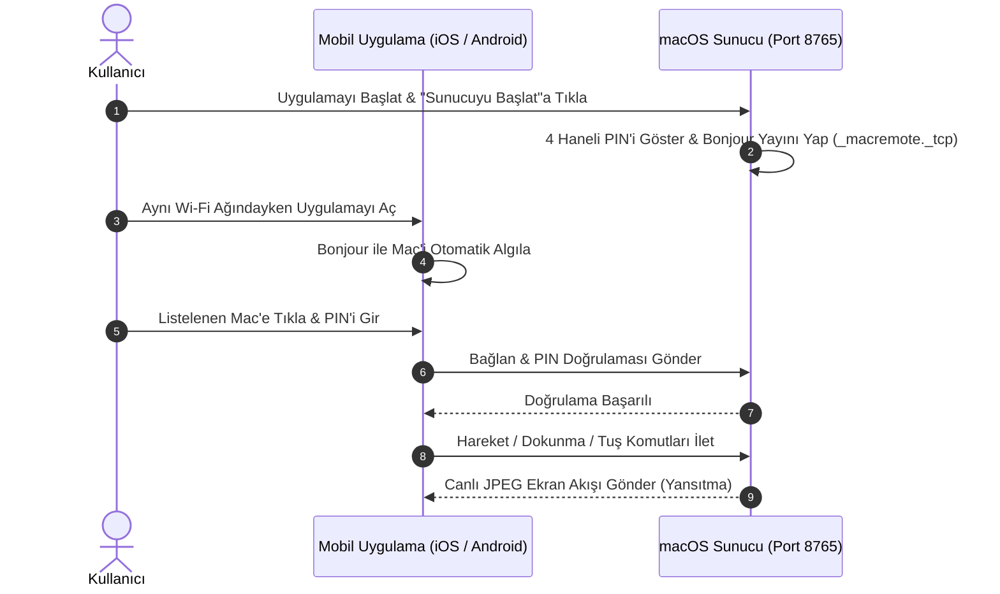

# 📦 Kurulum & Başlangıç Rehberi

  <a href="Installation-and-Setup"><b>🇬🇧 English</b></a> •
  <a href="Installation-and-Setup-TR"><b>🇹🇷 Türkçe</b></a>

Bu rehber; macOS sunucusunu, iOS (iPhone/iPad) uygulamasını ve Android istemcisini kurmanız ve cihazları ilk kez birbirine bağlamanız için gereken tüm adımları içerir.

---

## 1. macOS Sunucu Kurulumu

### Adım A: İndirme & Yükleme
1. [Mac Remote Sürümler (Releases)](https://github.com/ibrahimtemur/mac-remote-app/releases/latest) sayfasına gidin.
2. En güncel `MacRemote-v1.4.0.dmg` dosyasını indirin.
3. İndirilen DMG dosyasına çift tıklayın ve **Mac Remote.app** simgesini **Uygulamalar (Applications)** klasörüne sürükleyin.
4. Uygulamayı başlatın.

### Adım B: macOS İzinleri (Zorunlu!)
İmleci hareket ettirmek, tıklama/klavye komutlarını iletmek ve ekranı canlı aktarmak için macOS iki izin gerektirir:
1. **Erişilebilirlik (Accessibility):**
   - **Sistem Ayarları > Gizlilik ve Güvenlik > Erişilebilirlik** bölümüne gidin.
   - **Mac Remote** yanındaki anahtarı açık konuma getirin.
2. **Ekran Kaydı (Screen Recording):**
   - **Sistem Ayarları > Gizlilik ve Güvenlik > Ekran Kaydı** bölümünde Mac Remote'un ekranı yayınlamasına izin verin.
3. İzinler verildiğinde Mac Remote üzerindeki gösterge yeşile döner: `✓ Erişilebilirlik İzni: Verildi`.

---

## 2. iOS İstemci Kurulumu (iPhone & iPad)

1. Mac Remote uygulamasını Apple **App Store** veya **TestFlight** üzerinden yükleyin.
2. iPhone veya iPad'inizde uygulamayı açın.
3. Sorulursa, yerel ağdaki Mac'inizi Bonjour ile otomatik algılayabilmesi için **Yerel Ağ (Local Network)** iznine onay verin.

---

## 3. Android İstemci Kurulumu

### Seçenek 1: Google Play Store
Google Play üzerinden yükleyerek otomatik güncellemelerden yararlanın.

### Seçenek 2: Doğrudan APK İndirme (GitHub Releases)
1. Android cihazınızdan [GitHub Releases](https://github.com/ibrahimtemur/mac-remote-app/releases/latest) sayfasına gidin ve `MacRemote-Android-v1.4.0.apk` dosyasını indirin.
2. İndirilen `.apk` dosyasına dokunun ve **Yükle** deyin.

---

## 4. İlk Keşif & Bağlantı (Yerel Wi-Fi)

1. Mac'inizde **Sunucuyu Başlat** butonuna tıklayın. 4 haneli bir PIN belirecektir.
2. Aynı Wi-Fi ağındaki mobil uygulamanızı açın. Mac'iniz otomatik olarak listelenecektir.
3. Mac'inize dokunun, 4 haneli PIN'i girin ve kontrolün tadını çıkarın!
