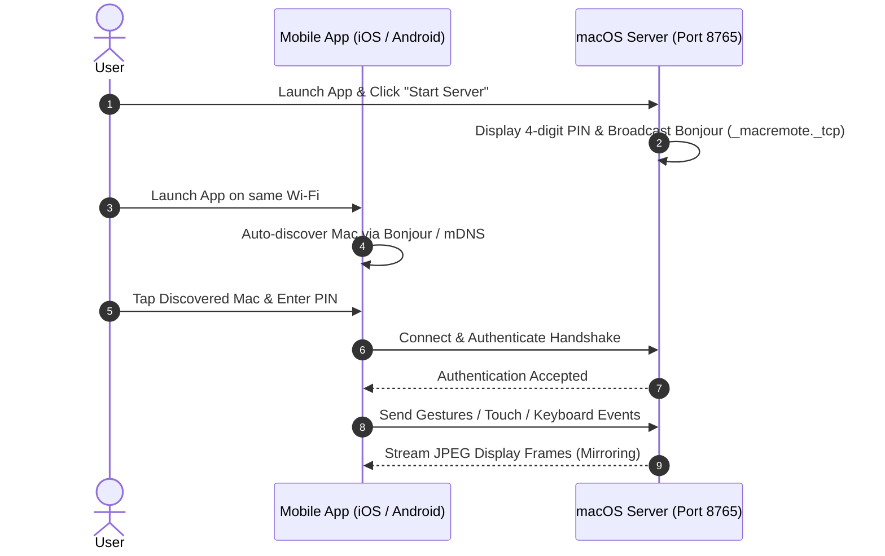

# 📦 Installation & Setup Guide

  <a href="Installation-and-Setup"><b>🇬🇧 English</b></a> •
  <a href="Installation-and-Setup-TR"><b>🇹🇷 Türkçe</b></a>

This guide walks you through installing the macOS host server application, the iOS client (iPhone/iPad), and the Android mobile client, as well as pairing them for the first time.

---

## 1. macOS Server Installation

### Step A: Download & Install
1. Head over to the [Mac Remote Releases](https://github.com/ibrahimtemur/mac-remote-app/releases/latest) page.
2. Download the latest signed `MacRemote-v1.4.0.dmg` file.
3. Open the `.dmg` file and drag **Mac Remote.app** into your `/Applications` folder.
4. Launch **Mac Remote** from your Applications folder.

### Step B: macOS Permissions (Crucial!)
To simulate mouse movements, clicks, keystrokes, and stream screen frames, macOS requires two permissions:
1. **Accessibility:**
   - Open **System Settings > Privacy & Security > Accessibility**.
   - Enable the toggle next to **Mac Remote**.
2. **Screen Recording:**
   - Under **System Settings > Privacy & Security > Screen Recording**, ensure **Mac Remote** is allowed to stream your display.
3. Once enabled, the indicators in Mac Remote will turn green: `✓ Accessibility: Granted`.

---

## 2. iOS Client Installation (iPhone & iPad)

1. Download Mac Remote via the Apple **App Store** or **TestFlight**.
2. Launch the app on your iPhone or iPad.
3. If prompted, grant Local Network access so the app can automatically discover your Mac via Bonjour.

---

## 3. Android Client Installation

### Option 1: Google Play Store
Download directly from Google Play for automatic updates and background optimization.

### Option 2: Direct APK Download (GitHub Releases)
1. On your Android device, download `MacRemote-Android-v1.4.0.apk` from [GitHub Releases](https://github.com/ibrahimtemur/mac-remote-app/releases/latest).
2. Open the downloaded `.apk` and tap **Install** (allow "Install Unknown Apps" if prompted by your browser).

---

## 4. Pairing for the First Time (Local Wi-Fi)

1. Click **Start Server** on Mac Remote on your Mac. A 4-digit PIN will appear.
2. Open the mobile app on the same Wi-Fi network. Your Mac will appear automatically under **Discovered Macs**.
3. Tap your Mac, enter the 4-digit PIN, and start controlling!
