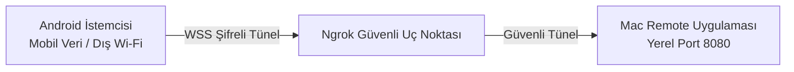

# 🌐 Uzaktan Erişim & Ngrok Tünelleme

<p align="center">
  <a href="Remote-Access-and-Ngrok"><b>🇬🇧 English</b></a> •
  <a href="Remote-Access-and-Ngrok-TR"><b>🇹🇷 Türkçe</b></a>
</p>

> [!NOTE]
> **v1.4.0 ile Kullanımdan Kaldırıldı:** Mac Remote, Ngrok bağımlılığından tamamen çıkarak kendi barındırdığımız izole ters tünel mimarisine geçmiştir. Lütfen güncel dokümantasyonu inceleyin: **[Uzaktan Erişim & WAN Ters Tünel](Remote-Access-and-WAN-TR)**.

Mac Remote, telefonunuz hücresel verideyken (4G/5G) veya ev/ofis dışındaki farklı bir Wi-Fi ağına bağlıyken bile Mac'inizi kontrol edebilmeniz için **Ngrok** tünel teknolojisini destekler.

---

## 🛠️ Nasıl Çalışır?



Ngrok etkinleştirildiğinde Mac Remote, Mac'iniz ile Ngrok sunucuları arasında güvenli, şifreli bir TLS tüneli açar. Bu sayede modeminizden port yönlendirmesi yapmanıza veya statik IP almanıza gerek kalmadan küresel olarak erişilebilir bir `wss://...ngrok-free.dev` adresi oluşturulur.

---

## 🚀 Ngrok Yapılandırması

### 1. Ücretsiz Ngrok Yetkilendirme Belirteci (AuthToken) Alın
1. [ngrok.com](https://ngrok.com) adresinden ücretsiz hesap açın.
2. Kontrol panelinizdeki **Your Authtoken** alanından belirtecinizi kopyalayın.

### 2. Mac'inizde Tanımlayın
İki yöntemden birini kullanabilirsiniz:

#### Yöntem A: Terminal Ortam Değişkeni
```bash
export NGROK_AUTHTOKEN="tokeniniz_buraya"
```

#### Yöntem B: Global Ngrok CLI
Eğer bilgisayarınızda `ngrok` komutu yüklüyse:
```bash
ngrok config add-authtoken tokeniniz_buraya
```
*Mac Remote kayıtlı tokeni otomatik algılayacaktır.*

---

## 📱 İnternet Üzerinden Bağlanma

1. Mac'inizde **"İnternet Erişimini Aç (Ngrok)"** kutucuğunu işaretleyin.
2. **Sunucuyu Başlat** butonuna basın.
3. 1-2 saniye içinde ekranda mavi renkli adres görünecektir:
   ```text
   wss://...ngrok-free.dev
   ```
4. Android uygulamanızda:
   - **Manuel Bağlantı (Örn. Ngrok URL)** bölümünü genişletin.
   - Bu adresi ve Mac'teki 4 haneli PIN'i girin.
   - **Bağlan** butonuna basın!
