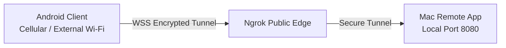

# 🌐 Remote Access & Ngrok Tunneling

<p align="center">
  <a href="Remote-Access-and-Ngrok"><b>🇬🇧 English</b></a> •
  <a href="Remote-Access-and-Ngrok-TR"><b>🇹🇷 Türkçe</b></a>
</p>

> [!NOTE]
> **Deprecated in v1.4.0:** Mac Remote has migrated from Ngrok to an isolated self-hosted reverse tunnel. Please see the updated documentation: **[Remote Access & WAN Reverse Tunnel](Remote-Access-and-WAN)**.

Mac Remote features native integration with **Ngrok** to allow control of your Mac even when your mobile phone is on cellular data (4G/5G) or connected to a different Wi-Fi network outside your home or office.

---

## 🛠️ How It Works



When Ngrok is enabled, Mac Remote opens a secure, authenticated TLS tunnel between your Mac and Ngrok's edge servers. This provides a globally reachable `wss://...ngrok-free.dev` address without requiring you to open ports on your router or configure static IP addresses.

---

## 🚀 Setting Up Ngrok Access

### 1. Get a Free Ngrok AuthToken
1. Sign up for a free account at [ngrok.com](https://ngrok.com).
2. Go to your dashboard and copy your **Authtoken** (under *Your Authtoken*).

### 2. Configure Your Mac
You can set your Ngrok AuthToken in one of two ways:

#### Method A: Terminal Environment Variable
Run this command in Terminal before opening the app:
```bash
export NGROK_AUTHTOKEN="your_token_here"
```

#### Method B: Global Ngrok CLI
If you have the `ngrok` command line tool installed:
```bash
ngrok config add-authtoken your_token_here
```
*Mac Remote will automatically detect and use your saved token.*

---

## 📱 Connecting from Android Over the Internet

1. On your Mac, check the box: **"Enable Internet Access (Ngrok)"** (`İnternet Erişimini Aç (Ngrok)`).
2. Click **Start Server** (`Sunucuyu Başlat`).
3. Within 1-2 seconds, a blue URL will appear on screen:
   ```text
   wss://strategic-press-armful.ngrok-free.dev
   ```
4. On your Android device:
   - Expand the **Manual Connection (e.g., Ngrok URL)** section.
   - Enter the full `wss://...` address.
   - Enter the 4-digit PIN shown on your Mac.
   - Tap **Connect**!

> [!TIP]
> Your Ngrok URL remains active as long as the macOS server is running. If you stop and restart the server, a new URL may be generated depending on your Ngrok account tier.
