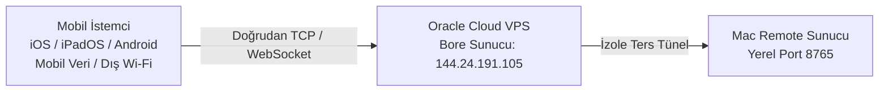

# 🌐 Uzaktan Erişim & WAN Ters Tünel

<p align="center">
  <a href="Remote-Access-and-WAN"><b>🇬🇧 English</b></a> •
  <a href="Remote-Access-and-WAN-TR"><b>🇹🇷 Türkçe</b></a>
</p>

Mac Remote, özel bulut altyapısı (Oracle Cloud Always Free VPS) üzerinde barındırılan yüksek hızlı, sıfır yapılandırmalı bir **Ters TCP Tüneli (Bore)** ile gelir. Bu teknoloji sayesinde **iPhone, iPad veya Android** cihazınız mobil verideyken (4G/5G) ya da ev/ofis dışındaki yabancı bir Wi-Fi ağına bağlıyken bile Mac'inizi dünyanın her yerinden gecikmesiz kontrol edebilirsiniz.

---

## 🛠️ Nasıl Çalışır?



1. Mac uygulamasında **"İnternet Erişimini Aç (WAN Tüneli)"** seçeneğini işaretleyip **Sunucuyu Başlat** dediğinizde, arka planda hafif bir tünel süreci devreye girer.
2. Sunucu, VPS üzerindeki boş portlardan birini (7836–7935 aralığı) güvenli HMAC şifreleme doğrulaması ile sizin Mac'inize dinamik olarak tahsis eder.
3. Mac Remote ekranında anında hem kopyalanabilir bir **Uzak Adres** (`ws://144.24.191.105:<port>`) hem de kamerayla taranabilir bir **Dinamik QR Kod** belirir.
4. Her Mac kullanıcısı tamamen izole ve bağımsız bir porta sahip olduğu için binlerce kullanıcı aynı anda çakışma yaşamadan uygulamayı kullanabilir.

---

## 🚀 İnternet Üzerinden Bağlantı Adımları

### 1. Adım: Mac'te WAN Tünelini Başlatın
1. Mac Remote uygulamasında **"İnternet Erişimini Aç (WAN Tüneli)"** kutucuğunu işaretleyin.
2. **Sunucuyu Başlat** butonuna tıklayın.
3. 1–2 saniye içinde arayüzde uzak adresiniz ve QR kodunuz görünecektir:
   ```text
   ws://144.24.191.105:7905
   ```

### 2. Adım: Telefondan / Tabletten Bağlanın
1. Telefonunuzdaki **Mac Remote** uygulamasını açın.
2. **Manuel Bağlantı (Uzak Adres)** kartına gelin.
3. Mac ekranında görünen `ws://...` adresini girin (veya QR kodu kullanın).
4. **Bağlan**'a tıklayıp Mac ekranındaki 4 haneli PIN'i girin.

> [!TIP]
> **Sıfır Yapılandırma:** Eski Ngrok mimarisinin aksine kullanıcıların hesap açması, token oluşturması ya da modemlerinden port açması kesinlikle gerekmez. Her şey otomatik ve ücretsiz çalışır!
