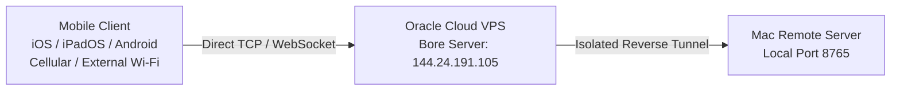

# 🌐 Remote Access & WAN Reverse Tunnel

<p align="center">
  <a href="Remote-Access-and-WAN"><b>🇬🇧 English</b></a> •
  <a href="Remote-Access-and-WAN-TR"><b>🇹🇷 Türkçe</b></a>
</p>

Mac Remote features a high-speed, zero-configuration **Reverse TCP Tunnel (Bore)** hosted on private dedicated infrastructure (Oracle Cloud Always Free VPS). This allows seamless remote control of your Mac from your **iPhone, iPad, or Android device** even over cellular data (4G/5G) or external Wi-Fi networks worldwide.

---

## 🛠️ How It Works



1. When you check **"Enable Internet Access (WAN Tunnel)"** and click **Start Server**, your Mac launches an isolated, lightweight tunnel process.
2. The server dynamically allocates an available dedicated port on the VPS (ports 7836–7935) protected by cryptographic HMAC authentication.
3. The Mac app generates both a clickable **Remote Address** (`ws://144.24.191.105:<port>`) and a real-time **QR Code** for instant pairing.
4. Each connected Mac receives an independent port, ensuring that multiple users worldwide can use the service concurrently without conflicts.

---

## 🚀 Connecting Over the Internet

### Step 1: Start the WAN Tunnel on Mac
1. On your Mac, check the box: **"Enable Internet Access (WAN Tunnel)"** (`İnternet Erişimini Aç (WAN Tüneli)`).
2. Click **Start Server** (`Sunucuyu Başlat`).
3. Within 1–2 seconds, your unique remote address and a QR code will appear:
   ```text
   ws://144.24.191.105:7905
   ```

### Step 2: Connect from Mobile (iOS, iPadOS, Android)
1. Open the **Mac Remote** mobile app.
2. Locate the **Manual Connection (Remote Address)** card.
3. Type the address displayed on your Mac (or scan the QR code).
4. Tap **Connect**, then enter the 4-digit PIN shown on your Mac's screen.

> [!TIP]
> **Zero Configuration Required:** Unlike legacy Ngrok setups, end-users do not need to register accounts, generate API tokens, or configure router port forwarding. Everything works out-of-the-box!
